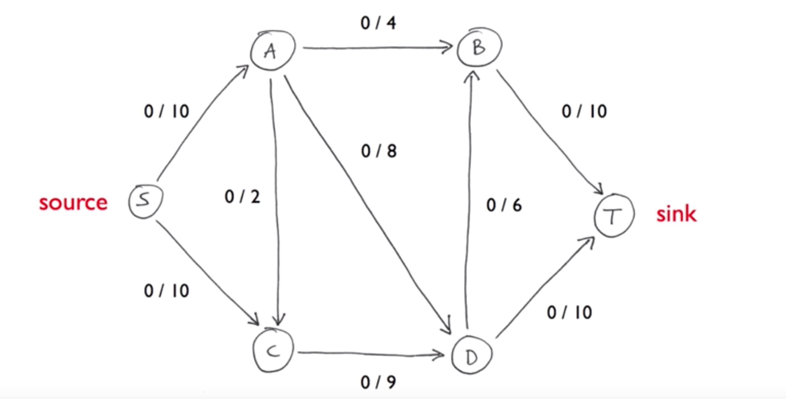

Day 49: Ford-Fulkerson
<br>
The Ford–Fulkerson method or Ford–Fulkerson algorithm (FFA) is a greedy algorithm that computes the maximum flow in a flow network. It is called a "method" instead of an "algorithm" as the approach to finding augmenting paths in a residual graph is not fully specified or it is specified in several implementations with different running times. It was published in 1956 by L. R. Ford, Jr. and D. R. Fulkerson. The name "Ford–Fulkerson" is often also used for the Edmonds–Karp algorithm, which is a fully defined implementation of the Ford–Fulkerson method.
<br>
The idea behind the algorithm is as follows: as long as there is a path from the source (start node) to the sink (end node), with available capacity on all edges in the path, we send flow along one of the paths. Then we find another path, and so on. A path with available capacity is called an augmenting path.
<br>
network:

<br>
run:
```
fn main() {
    let start = 's';
    let sink = 't';
    let mut ford_fulkerson = FordFulkerson::new(start, sink);
    ford_fulkerson.add_edge(start, 'A', 10);
    ford_fulkerson.add_edge(start, 'C', 10);
    ford_fulkerson.add_edge('A', 'B', 4);
    ford_fulkerson.add_edge('A', 'C', 2);
    ford_fulkerson.add_edge('A', 'D', 8);
    ford_fulkerson.add_edge('B', sink, 10);
    ford_fulkerson.add_edge('C', 'D', 9);
    ford_fulkerson.add_edge('D', 'B', 6);
    ford_fulkerson.add_edge('D', sink, 10);
    let max_flow = ford_fulkerson.find_max_flow();
    assert_eq!(max_flow, 19);
}
```